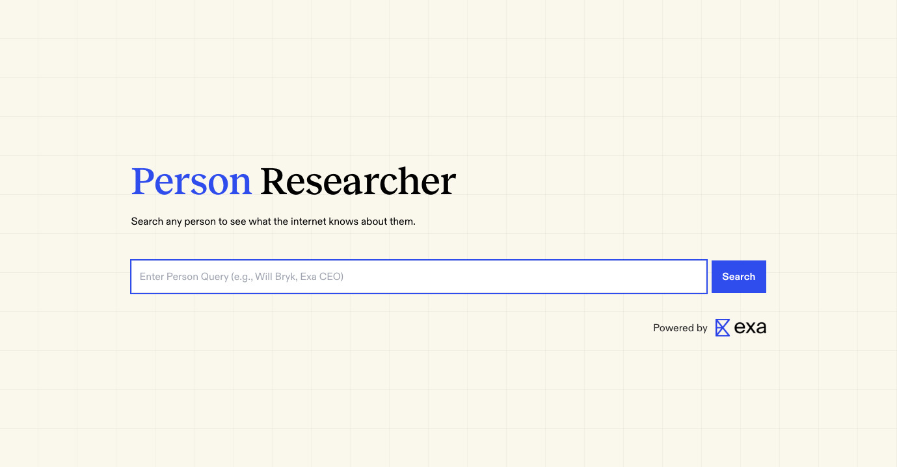

# 🔎 Person Researcher
### Powered by [Exa.ai](https://exa.ai) - The Search Engine for AI Applications



<br>

## 🎯 What is Person Researcher?

Person Researcher is a free and open-source tool that helps you instantly understand any person inside out. Simply input a person's name or details, and the tool gathers comprehensive information from across the web, presenting you with detailed insights about the individual, their background, career, and more.

<br>

## ✨ Features

- **Smart Profile Search**: Search for people by name across LinkedIn and Wikipedia
- **Comprehensive Research**: Get detailed summaries, career timelines, and key skills
- **Fun Insights**: Discover interesting facts and trivia about the person
- **Balanced Perspective**: AI-generated roasts and praise for entertainment
- **Similar People**: Find other individuals with comparable backgrounds
- **Multiple Sources**: Leverages both professional (LinkedIn) and encyclopedic (Wikipedia) data

<br>

## 📊 Data Sources
> All data is fetched using Exa's powerful search API optimized for person research.

1. **LinkedIn Profiles**
   - Professional background and experience
   - Current and past positions
   - Skills and endorsements
   - Professional network connections

2. **Wikipedia Articles**
   - Biographical information
   - Notable achievements and contributions
   - Historical significance
   - Public recognition and awards

3. **Supplementary Web Sources**
   - News articles and interviews
   - Social media presence
   - Published works and content
   - Professional accomplishments

<br>

## 💻 Tech Stack
- **Search Engine**: [Exa.ai](https://exa.ai) - Web search API optimized for AI applications
- **Frontend**: [Next.js](https://nextjs.org/docs) with App Router, [TailwindCSS](https://tailwindcss.com), TypeScript
- **AI Integration**: [Vercel AI SDK](https://sdk.vercel.ai/docs/ai-sdk-core)
- **Hosting**: [Vercel](https://vercel.com/)

<br>

## 🚀 Getting Started

### Prerequisites
- Node.js
- Exa.ai API key
- OpenAI API key
- (Optional) YouTube API key
- (Optional) GitHub token

### Installation

1. Clone the repository
```bash
git clone https://github.com/exa-labs/person-researcher.git
cd person-researcher
```

2. Install dependencies
```bash
npm install
# or
yarn install
```

3. Set up environment variables as described in the section below

4. Run the development server
```bash
npm run dev
# or
yarn dev
```

5. Open http://localhost:3000 in your browser

<br>

## 🔑 API Keys & Environment Setup

### Required API Keys
* **Exa API Key**: Get from [Exa Dashboard](https://dashboard.exa.ai/api-keys)
* **OpenAI API Key**: Get from [OpenAI Platform](https://platform.openai.com/api-keys)

### Environment Setup

Create a `.env.local` file in the root directory with the following structure:

```env
# Required
EXA_API_KEY=your_exa_api_key
OPENAI_API_KEY=your_openai_api_key
```

> For deployment on platforms like Vercel, add these environment variables in your platform's settings.

Alternatively, you can create a copy of our example environment file:
```bash
cp .env.example .env.local
```
Then fill in your API keys in the newly created `.env.local` file.

<br>

## ⭐ About [Exa.ai](https://exa.ai)

This project is powered by [Exa.ai](https://exa.ai), a powerful search engine and web search API designed specifically for AI applications. Exa provides:

* Advanced semantic search capabilities
* Clean web content extraction
* Real-time data retrieval
* Comprehensive web search functionality
* Superior search accuracy for AI applications

[Try Exa search](https://exa.ai/search)

<br>

---

Built with ❤️ by team Exa
